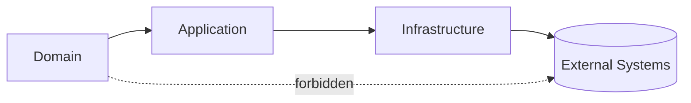

# ADR-0001 BaseArchitecture

- Status: Proposed
- Date: 2026-02-28
- Deciders: ArchitectureBoard
- Tags: `HexagonalArchitecture`, `DomainDrivenDesign`, `SecurityByDesign`, `Scalability`

## Context
- System must support multi-tenant reminder scheduling with strict auditability.
- System must scale horizontally without cross-tenant coupling.
- Security baseline requires mTLS internally and JWT externally.
- Team objective is Greenpause-first delivery with documentation as source of truth.

## Decision
- Adopt `HexagonalArchitecture` with explicit `PortsAndAdapters`.
- Organize repository by domain and use-case boundaries using `DomainDrivenDesign`.
- Use baseline runtime stack:
  - Service runtime: Go (planned)
  - Primary store: Postgres
  - Scheduling index: Redis
  - Async dispatch: queue abstraction (provider-neutral)
- Enforce dependency direction:
  - `internal/domain` depends on no infrastructure package.
  - `internal/application` depends on domain + port interfaces.
  - `internal/infrastructure` depends on application/domain interfaces.

## DecisionDiagram

## Rationale
- Hexagonal boundaries minimize framework lock-in and simplify adapter replacement.
- DDD model captures invariants where they are testable and stable.
- Postgres offers strong consistency for lifecycle state transitions.
- Redis provides low-latency due-time indexing for scheduler workers.
- Queue decouples scheduling from provider-specific dispatch behavior.

## Consequences
- Positive:
  - Clear module boundaries and lower accidental coupling.
  - Predictable change impact for adapter-level changes.
  - Improved auditability through explicit command/query boundaries.
- Negative:
  - More initial interface design overhead.
  - Requires disciplined dependency governance in CI.

## SecurityDecisionDetails
- Internal calls require mTLS with workload identity.
- External auth uses JWT (`RS256`) with JWKS-based key rotation.
- Service-to-service authorization bound to `TenantId` and least-privilege scopes.

## NFRAlignment
| NFR | Architectural Mechanism |
| --- | --- |
| Latency | CQRS split + low-latency schedule index in Redis |
| Availability | Stateless API/worker containers + shard isolation |
| Security | mTLS + JWT + immutable audit logs |
| Scalability | Tenant-based sharding and partition-aware processing |

## AlternativesConsidered
1. LayeredMonolith without ports/adapters.
- Rejected because infrastructure coupling would weaken long-term maintainability.
2. EventSourcing-only architecture.
- Rejected for higher operational complexity in phase 1.
3. Single database without sharding.
- Rejected because tenant growth would force disruptive re-architecture.

## ComplianceAndGovernance
- Every boundary change requires ADR update.
- Any exception to dependency direction requires explicit waivers.
- RFC approval required before adding new external adapters.

## Related
- System overview: [`../architecture/system-overview.md`](../architecture/system-overview.md)
- Core logic RFC: [`../rfc/0001-core-logic.md`](../rfc/0001-core-logic.md)
