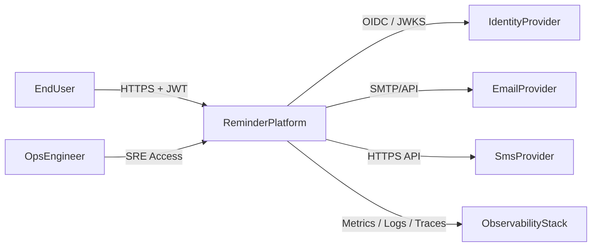
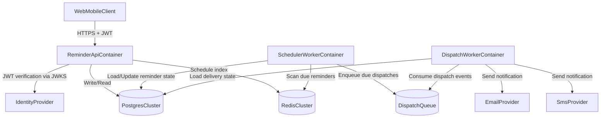
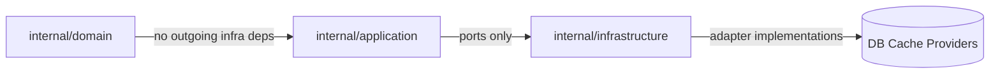
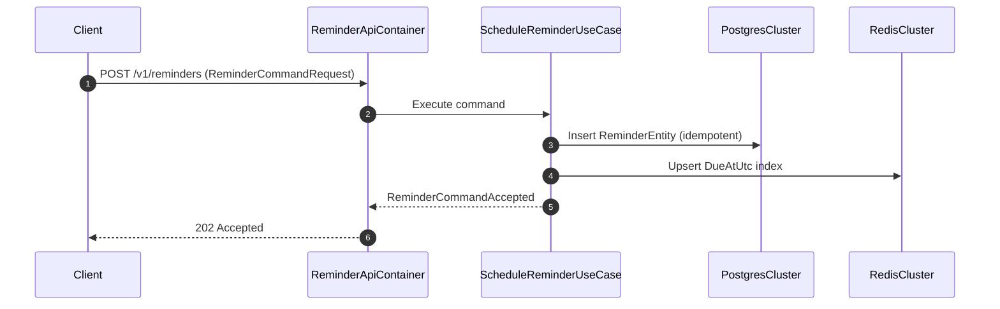

# SystemOverview

## 1. IntroductionAndGoals
### 1.1 Goal
- Provide a multi-tenant reminder platform with deterministic scheduling behavior and auditable delivery.

### 1.2 QualityGoals
| QualityAttribute | Target | ValidationMethod |
| --- | --- | --- |
| Latency | API `p95 <= 120ms`, `p99 <= 250ms` | Load test + distributed tracing |
| Availability | `99.95%` monthly | SLI/SLO dashboard |
| SchedulingPrecision | Trigger jitter `p99 <= 3s` | Worker lag telemetry |
| Security | Mandatory `mTLS` and JWT validation | Penetration test + policy checks |
| Recoverability | `RPO <= 5m`, `RTO <= 30m` | Disaster recovery rehearsal |

## 2. Constraints
- Design style: `HexagonalArchitecture` + `DomainDrivenDesign`.
- Repository policy: no runtime source implementation before Greenpause sign-off.
- Transport baseline: HTTPS externally, mTLS internally.
- Identity baseline: JWT access tokens with short lifetime (`<= 15m`).

## 3. ContextAndScope (arc42)
### 3.1 ExternalInterfaces
- `EndUser` via Web/Mobile clients.
- `IdentityProvider` for token issuance.
- `EmailProvider` and `SmsProvider` for outbound notifications.
- `OpsEngineer` via observability stack.

### 3.2 C4Level1SystemContext

## 4. SolutionStrategy (arc42)
- Keep domain model independent from infrastructure libraries.
- Implement use cases as application services consuming ports.
- Keep adapters replaceable and isolated in infrastructure layer.
- Separate write and read execution paths to preserve latency budgets.
- Guarantee idempotent command handling.

## 5. BuildingBlockView (arc42)
### 5.1 C4Level2ContainerView

### 5.2 LayeringRule

## 6. RuntimeView (arc42)
### 6.1 ScheduleReminder Runtime

## 7. DeploymentView (arc42)
- Runtime topology: stateless API pods + worker pods.
- Database topology: Postgres primary + replicas per shard group.
- Cache topology: Redis cluster with hash slot partitioning.
- Sharding policy:
  - Unit: `TenantId`
  - Formula: `ShardId = Hash(TenantId) mod N`
  - Expansion strategy: online shard split + tenant reassignment.

## 8. CrossCuttingConcepts (arc42)
### 8.1 SecurityConcept
- mTLS for east-west traffic with automated certificate rotation.
- JWT validation requirements:
  - Required claims: `iss`, `sub`, `aud`, `exp`, `iat`, `jti`, `TenantId`.
  - Clock skew tolerance: max 60 seconds.
  - Token replay mitigation: `jti` cache TTL = token lifetime.
- Audit logging:
  - Immutable event stream for `Create`, `Cancel`, `Acknowledge`, `Dispatch`.
  - Correlation fields: `CorrelationId`, `TenantId`, `ReminderId`, `ActorId`.

### 8.2 PerformanceConcept
- Command path budget breakdown:
  - Auth + validation: 15ms p95
  - Persistence write: 25ms p95
  - Schedule index update: 15ms p95
  - Response serialization: 5ms p95
- Worker throughput target:
  - Scheduler: 50k due reminders/minute
  - Dispatcher: 20k notifications/minute per shard

### 8.3 ScalabilityConcept
- Horizontal scaling for API and workers based on queue lag + CPU.
- Read scaling via replicas for query path.
- Partition-aware routing for tenant-level affinity.

## 9. ArchitectureDecisions (arc42)
- ADR reference: [`../adr/0001-base-architecture.md`](../adr/0001-base-architecture.md)
- RFC reference: [`../rfc/0001-core-logic.md`](../rfc/0001-core-logic.md)

## 10. RisksAndTechnicalDebt (arc42)
- Risk: hot-tenant skew causing shard imbalance.
- Mitigation: tenant heatmap monitoring + controlled tenant migration tooling.
- Risk: external provider API throttling.
- Mitigation: circuit breaker + adaptive retry policy.

## 11. QualityScenarios (arc42)
- Scenario `QS-001`: At 2k RPS, command API maintains p95 <= 120ms.
- Scenario `QS-002`: One shard outage does not block unaffected shard groups.
- Scenario `QS-003`: Expired JWT is rejected within 5ms after claim parsing.

## 12. Glossary (arc42)
- `ReminderEntity`: Aggregate root for reminder lifecycle.
- `ReminderDispatchEvent`: Immutable event emitted when reminder is due.
- `ShardGroup`: Isolated persistence slice for a tenant subset.
