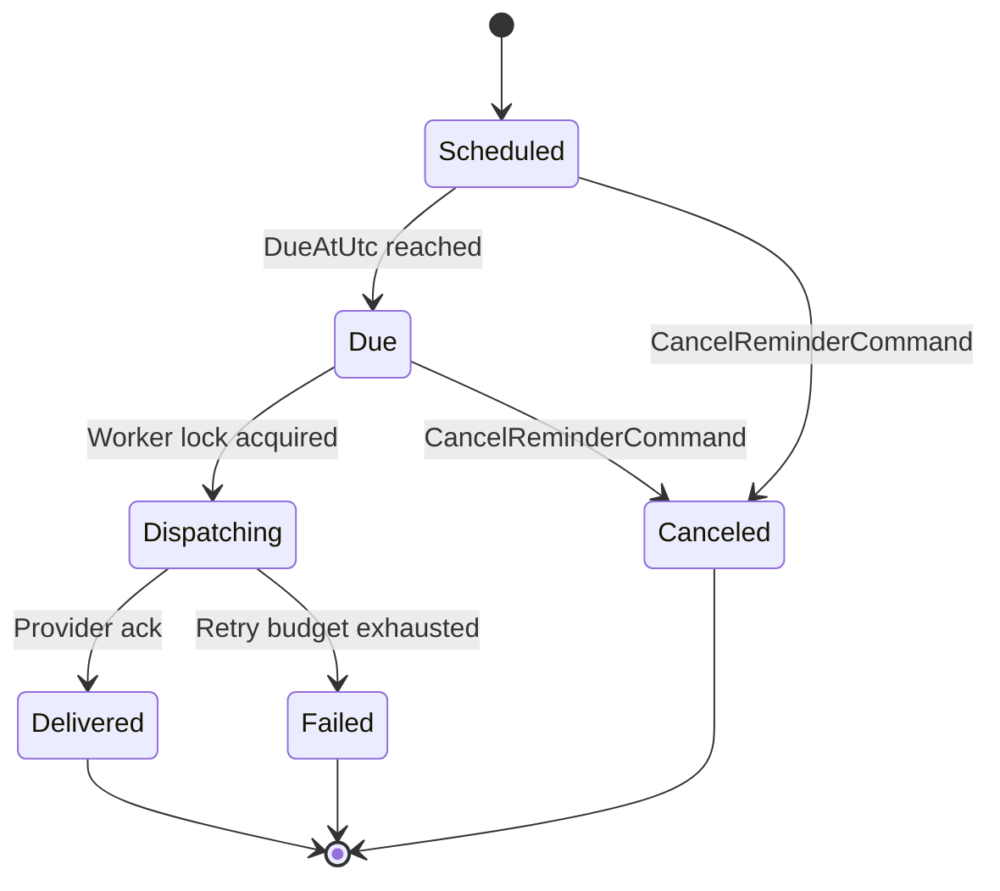
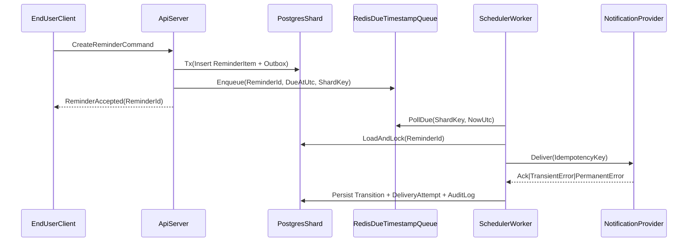

# RFC 0001: CoreReminderSchedulingLogic

## Status
- Proposed

## Date
- 2026-03-01

## Related Documents
- Architecture overview: [`../architecture/system-overview.md`](../architecture/system-overview.md)
- Base ADR: [`../adr/0001-base-architecture.md`](../adr/0001-base-architecture.md)
- API contract: [`../../api/openapi/reminder-v1.yaml`](../../api/openapi/reminder-v1.yaml)

## 1. ExecutiveSummary
- Define deterministic scheduling and delivery logic for `ReminderItem` in a multi-tenant environment.
- Guarantee dispatch precision, idempotent delivery, and bounded retry behavior.
- Ensure algorithm remains independent from concrete transport and provider implementations.

## 2. Goals
1. Deterministic due-time processing with `<= 1s` drift for `99.9%` of reminders.
2. Idempotent dispatch across retries and worker restarts.
3. Tenant-isolated throughput scaling via shard-aware queue partitioning.
4. Complete auditability of state transitions.

## 3. NonGoals
1. Full recurrence grammar (RRULE) in v1.
2. Cross-tenant deduplication.
3. Provider-specific content rendering workflows.

## 4. DomainModel
### 4.1 Core Aggregates and ValueObjects
| Object | Type | Invariants |
|---|---|---|
| `ReminderItem` | Aggregate | Immutable `ReminderId`, immutable `TenantId`, monotonic status transitions |
| `ReminderSchedule` | ValueObject | `DueAtUtc >= CreatedAtUtc + 5s` |
| `ReminderStatus` | Enum | `Scheduled -> Due -> Dispatching -> Delivered` or `Failed` or `Canceled` |
| `DeliveryAttempt` | Entity | Strictly increasing `AttemptNumber`, unique idempotency key |
| `ShardKey` | ValueObject | `Hash(TenantId) mod ShardCount` |

### 4.2 StateTransitionRules
1. `Scheduled -> Due` only when `NowUtc >= DueAtUtc`.
2. `Due -> Dispatching` requires distributed lock acquisition.
3. `Dispatching -> Delivered` only on provider acknowledgment.
4. `Dispatching -> Failed` after retry budget exhaustion.
5. `Canceled` is terminal, except for audit append operations.

## 5. DataModel (Logical)
| Table/Stream | Partition Key | Notes |
|---|---|---|
| `ReminderItems` | `ShardKey` | Primary lifecycle state |
| `ReminderOutbox` | `ShardKey` | Durable scheduling events |
| `DueTimestampQueue` | `ShardKey + DueBucket` | Redis sorted-set or stream abstraction |
| `DeliveryAttempts` | `ReminderId` | Immutable append-only attempts |
| `AuditLog` | `TenantId + Timestamp` | Compliance and forensic timeline |

## 6. Algorithm Design
### 6.1 CreateReminder Flow
1. Validate command invariants (`DueAtUtc`, ownership, payload size).
2. Persist `ReminderItem(Scheduled)` and `ReminderOutbox(ReminderCreated)` in one transaction.
3. Publish `DueTimestamp` to `DueTimestampQueue`.
4. Return `ReminderId` and normalized schedule metadata.

### 6.2 DueReminder Dispatch Loop
1. Poll queue partitions assigned to worker shard leases.
2. For each due candidate, attempt lock on `ReminderId`.
3. Load latest state from `ReminderItems`; skip non-dispatchable states.
4. Transition to `Dispatching`; persist `DeliveryAttempt(AttemptNumber=n)`.
5. Send to `NotificationProvider` with idempotency key.
6. On ack: transition to `Delivered`; append `AuditLog`.
7. On transient error: schedule retry with exponential backoff + jitter.
8. On permanent error or retry exhaustion: transition to `Failed`; append `AuditLog`.

### 6.3 Deterministic Backoff Formula
- `RetryDelaySeconds = min(BaseDelay * 2^(AttemptNumber-1), MaxDelay) + Jitter(0..JitterCap)`
- Baseline values:
1. `BaseDelay = 5s`
2. `MaxDelay = 900s`
3. `JitterCap = 3s`
4. `MaxAttempts = 8`

## 7. Sequence View

## 8. ConcurrencyAndConsistency
1. Use optimistic concurrency on `ReminderItem.Version`.
2. Distributed lock TTL must exceed max provider timeout by `+20%`.
3. Worker lease ownership changes use fencing tokens to prevent split-brain writes.
4. Outbox-to-queue publish is at-least-once; consumer deduplicates by idempotency key.

## 9. Security Design
1. API commands require JWT claims: `sub`, `tenant`, `scope`.
2. Worker/provider credentials are stored in KMS-backed secret stores.
3. mTLS required for internal API and queue control-plane calls.
4. AuditLog is append-only with tamper-evident hash chain per `TenantId`.

## 10. NFR Budgets
| Dimension | Budget | Control Mechanism |
|---|---|---|
| API CreateReminder | `P95 <= 180ms` | Transaction scope and indexed writes |
| Queue Poll Cycle | `<= 200ms` per partition | Partition-local batching |
| Dispatch Drift | `<= 1s` for `99.9%` | Fine-grained due buckets + clock sync |
| Retry Throughput | `>= 5,000/min/shard` | Horizontal worker scaling |
| Provider Timeout | `<= 3s` default | Circuit breaker + fallback provider |

## 11. Sharding Strategy
1. `ShardCount` is configurable and versioned.
2. Tenant-to-shard mapping uses consistent hashing ring with virtual nodes.
3. Online migration steps:
1. Add target virtual nodes.
2. Start dual-read validation for migrated tenants.
3. Cut write traffic using shard fencing token.
4. Complete migration and invalidate old leases.

## 12. Observability Specification
### 12.1 Metrics
- `ReminderDueQueueLagMs{ShardId}`
- `ReminderDispatchSuccessRate{Provider,ShardId}`
- `ReminderDispatchAttemptsTotal{Result}`
- `ReminderStateTransitionTotal{From,To}`
- `ReminderSchedulingDriftMs{ShardId}`

### 12.2 Alerts
1. Critical: `SchedulingDriftP99 > 3000ms for 5m`.
2. High: `DispatchSuccessRate < 98% for 10m`.
3. High: `QueueLagMsP95 > 5000ms for 10m`.
4. Medium: `JWTValidationFailureRate > 1% for 5m`.

## 13. RisksAndAlternatives
| Topic | Chosen Approach | Alternative |
|---|---|---|
| Queue model | Redis due buckets | Kafka delayed topics |
| Retry policy | Exponential + bounded jitter | Linear retry |
| Dispatch ownership | Lease + lock + fencing | Global serialized dispatcher |

## 14. OpenQuestions
1. Should recurrence be integrated as `RecurrenceRule` ValueObject in v1.1 or deferred to v2?
2. Is multi-provider active-active dispatch required per tenant SLA tier?
3. Should `AuditLog` hash chain anchors be periodically notarized externally?

